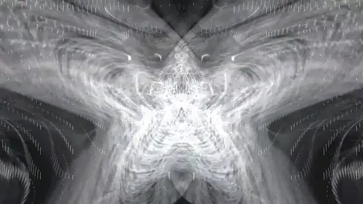

# Prism

<p align="center">
  
</p>

**Generative visualization.** Signals in. Light fields out.

Prism turns real-time signals into live visuals. Audio is one
signal. So are heartbeat, breath, pose, cursor, MIDI, and AI agent
state. Anything that streams can drive a visual.

Today, Prism composites existing visualization code. It runs
[Milkdrop](https://www.geisswerks.com/about_milkdrop.html) presets
through [butterchurn](https://github.com/jberg/butterchurn). It runs
[Shadertoy](https://www.shadertoy.com/) fragment shaders through a
custom WebGL2 runtime. An LLM routes prompts to the right one.
AI-generated shaders are in development.

Live demo at [prism.scott.ai](https://prism.scott.ai).

Play with the two-line embed in
[CodeSandbox](https://codesandbox.io/p/sandbox/github/Tensor-Doc/prism/main/examples/codesandbox).

Install from npm as [`@tensordoc/prism`](https://www.npmjs.com/package/@tensordoc/prism).

---

## ▶ Use the visualizer in your code

```bash
npm install @tensordoc/prism
```

```html
<div id="viz" style="width:100vw;height:100vh"></div>
<script type="module">
  import { PrismPlayer } from "@tensordoc/prism";
  new PrismPlayer({ container: "viz" });
</script>
```

That's the entire pitch. Drop a div, instantiate the player. The
visualization runs against a built-in synthetic signal until you
connect real audio. Works in vanilla HTML, React, Vue, Svelte,
Next.js, and Astro. See the [package README](packages/prism/README.md)
for framework-specific patterns.

Common variants.

```js
// React
const ref = useRef(null);
useEffect(() => {
  const p = new PrismPlayer({ container: ref.current, graph: "PTzsKc" });
  return () => p.destroy();
}, []);
return <div ref={ref} />;

// With a specific catalog visualization
new PrismPlayer({ container: "viz", graph: "PTzsKc" });

// With your microphone driving it
new PrismPlayer({ container: "viz", audio: "mic" });

// With a slideshow of your own images
new PrismPlayer({ container: "viz", image: ["a.jpg", "b.jpg"] });
```

Full API in [`packages/prism/README.md`](packages/prism/README.md).

## 🤖 Use the visualizer from an AI agent

A Claude Code skill ships with the repo. It lets any agent generate
visualizations or embed them into a user's project. The skill works
from Claude Code, the Claude API, and OpenAI function calling.

```bash
mkdir -p ~/.claude/skills/prism-visualizer
curl -o ~/.claude/skills/prism-visualizer/SKILL.md \
  https://raw.githubusercontent.com/Tensor-Doc/prism/main/skills/prism-visualizer/SKILL.md
```

Restart Claude Code. Now you can ask things like.

- *"Make me a calming cosmic visualizer"* returns a
  `prism.scott.ai/?g=<id>` URL.
- *"Add a music visualizer to this React app"* installs the
  package, writes the component, and wires up the lifecycle.

The skill handles two flows. The first generates a visualization. It
calls `/api/generate` and returns a share URL. The second embeds
prism in a project. It detects the framework from `package.json`,
runs the right install command, and scaffolds the right component.
Full spec at
[`skills/prism-visualizer/SKILL.md`](skills/prism-visualizer/SKILL.md).

### From the raw API

For custom agent integrations like an OpenAI function call, an n8n
workflow, or your own tool, the endpoint is straightforward.

```bash
curl -X POST https://prism.scott.ai/api/generate \
  -H "Content-Type: application/json" \
  -d '{ "prompt": "calming cosmic nebula" }'
```

Response.

```json
{
  "graph": { /* full prism.graph/0.1 document */ },
  "short_id": "PTzsKc"
}
```

Build the share URL as `https://prism.scott.ai/?g=<short_id>` and
hand it to the user. Or pass the graph object directly to
`new PrismPlayer({ graph })`.

---

## Where Prism fits

| Modality | API |
|---|---|
| Voice | ElevenLabs |
| Image | Stability, Midjourney |
| Music | Suno |
| Video | Runway, Veo |
| **Visualization** | **Prism** |

None of the other modality APIs are time-streaming-native. Prism is
shaped around streaming input. Audio, heart rate, log volume, agent
state, all rendered live. That's the angle.

---

## How a prompt becomes a visual

Every visualization is a small node graph. The graph is JSON. It
says how signals turn into frames, then how those frames reach the
screen. You give the API a prompt. Gemini writes the graph. The
browser runs it.

Here's a typical graph today.

```jsonc
{
  "schema": "prism.graph/0.1",
  "id": "g_calm_cosmic",
  "intent": "calming cosmic fluid that breathes with bass",
  "nodes": {
    "audio":  { "type": "signal.audio" },
    "main":   {
      "type":   "lf.shadertoy",
      "params": { "shader_url": "/presets/shadertoy/cosmic-flow.glsl" },
      "inputs": { "audio": "audio.signal" }
    },
    "screen": {
      "type":   "sink.display",
      "inputs": { "frame": "main.frame" }
    }
  },
  "output": "screen"
}
```

Five node roles.

| Role | What it does | Examples |
|---|---|---|
| `signal.*` | Makes a stream of data | `signal.audio`, `signal.cursor`, `signal.heartbeat` |
| `xform.*` | Changes a signal | `xform.gain`, `xform.beat` |
| `lf.*` | Makes frames from signals | `lf.milkdrop`, `lf.shadertoy` |
| `op.*` | Changes frames | `op.blend`, `op.displace`, `op.feedback` |
| `sink.*` | Sends frames somewhere | `sink.display`, `sink.recorder` |

Today's graphs use three nodes. A signal. A generator. A sink. Future
graphs will layer many generators. New node types plug in without
rewrites.

### Why a JSON notation?

[TouchDesigner](https://derivative.ca/),
[Notch](https://www.notch.one/),
[Cables.gl](https://cables.gl/),
[vvvv](https://vvvv.org/),
and [ComfyUI](https://github.com/comfyanonymous/ComfyUI) all use
node graphs. Each one uses its own format. Prism proposes an open JSON
notation so visualizers are easy on three fronts.

- **agent-friendly**. An AI can read and write a graph.
- **shareable**. A graph is about 1 KB. A URL hash carries the whole thing.
- **editable**. By prompt today. By node editor tomorrow. By hand whenever.

---

## What's in this repo

```
src/landing/        live web app, the visualizer and prompt loop
src/gallery/        the catalog browser at /gallery.html
scripts/prism/      the `pnpm prism` CLI for ingest, annotate, build-index
scripts/pipelines/  Puppeteer harnesses, Gemini annotator, R2 uploader
api/                Vercel functions for generate, image-proxy, unsplash
lib/                shared serverless helpers, R2 and cache policy
packages/prism/     the @tensordoc/prism npm package source
skills/prism-visualizer/   Claude skill spec
catalog/entries/    one JSON file per entry. The source of truth.
catalog/index.json  built artifact, consumed by the gallery and API
public/presets/     hand-seeded shaders in Shadertoy-flavor GLSL
examples/embed.html proves the two-line pitch
BRAND.md            design system and aesthetic decisions
```

The catalog is the heart of Prism. Today there are **336 annotated
entries out of 644 total**. All videos are captured headless.
Cloudflare R2 hosts them.

---

## Three ways to contribute

Prism grows with every contributor. Think Wikipedia for visualizations.
AI is the curator.

### 1. Run the capture pipeline on your machine

Add presets or shaders you like. Capture them. Annotate them. Send a
PR.

```sh
git clone git@github.com:Tensor-Doc/prism.git
cd prism && pnpm install
cp .env.example .env       # add GEMINI_API_KEY, R2_*, VITE_GEMINI_API_KEY

pnpm dev                                          # the capture server
pnpm prism ingest <path-to-presets-or-shaders>    # adds catalog/entries/*
pnpm prism annotate --all                         # capture, annotate, upload
pnpm prism build-index                            # rebuild catalog/index.json

git add catalog/ && git commit -m "Add N presets" && pr it
```

Each entry takes about 15 seconds to capture, then about 3 seconds
to annotate. You can add 50 to 100 entries in a Saturday afternoon.

**GPU note.** The capture pipeline runs headless Chrome on your real
GPU through ANGLE. On macOS that means Metal. On Linux it's GL. On
Windows it's D3D11. Heavy presets like Geiss Cauldron and reaction
diffusion need a real GPU to compile within the timeout. A pure-CPU
fallback exists, but every Geiss preset times out under it.

### 2. Add a new visualization source

Today Prism runs two sources. **Milkdrop** through butterchurn.
**Shadertoy** through a custom WebGL2 runtime. Next on the list are
ISF and hand-written WGSL.

Each new source needs two files.

```
packages/prism/src/backends/<source>.ts             # the live runtime
scripts/pipelines/capture-pages/<source>.html       # the capture harness
```

The shared `CatalogEntry` schema does the rest. The gallery, the API,
and the prompt loop work without changes.

### 3. Add a signal source

Signals make visualizations react. The app already supports cursor,
audio from a shared tab, microphone, heart rate from Pulsoid, and a
synthetic pink-noise driver. Camera, pose, MIDI, breath, OSC, EEG,
all welcome. A signal is a small module that streams numbers,
vectors, or textures.

---

## Quick start

```sh
git clone git@github.com:Tensor-Doc/prism.git
cd prism
pnpm install
pnpm dev
# visualizer:  http://localhost:5173/landing.html
# gallery:     http://localhost:5173/gallery.html
```

For full functionality including Unsplash, the R2-backed catalog,
and Gemini routing, copy `.env.example` to `.env` and fill in the
keys. The site falls back gracefully if any are missing.

---

## Environment variables

For deploying or running this whole repo. The `@tensordoc/prism` npm
package itself needs nothing. Copy `.env.example` to your project
root and fill in.

### Required for the website

| Var | What for | Where to get |
|---|---|---|
| `GEMINI_API_KEY` | Prompt to graph routing | [aistudio.google.com/apikey](https://aistudio.google.com/apikey) |
| `VITE_GEMINI_API_KEY` | Same key, exposed to the client for studio dev mode | Same as above |
| `VITE_NASA_API_KEY` | NASA image library calls | [api.nasa.gov](https://api.nasa.gov) |

### Required for Unsplash as an image source

| Var | What for |
|---|---|
| `UNSPLASH_ACCESS_KEY` | Server-side search API key |
| `UNSPLASH_APPLICATION_ID` | App ID. Kept for completeness, not currently used |
| `UNSPLASH_SECRET_KEY` | App secret. Used if we expand to write-style endpoints |

**Don't have an Unsplash app yet?** Register at
[unsplash.com/developers](https://unsplash.com/developers). Free, no
card required. Create a new application. The Access Key, Application
ID, and Secret all show up on the app's settings page. Demo apps get
**50 search requests per hour**, plenty for development. The
production tier of 5000 per hour requires a short review.

### Required for the R2 image-feed cache

The R2 cache is a small bounded metadata store. It survives Unsplash
rate-limit windows during dev. The cap is 50 entries. All four vars
must be set for the cache to activate. If any are missing, the
search endpoint falls back to live-only.

**Don't have R2 yet?** Sign up at
[cloudflare.com/products/r2](https://www.cloudflare.com/products/r2/).
The free tier covers 10 GB of storage, 1 million Class A operations
per month, and almost zero egress. After enabling R2 in the
dashboard, create an API token under
[**R2 → Manage R2 API Tokens**](https://dash.cloudflare.com/?to=/:account/r2/api-tokens)
to get the Access Key ID and Secret. The account ID is visible in
the top-right of any Cloudflare dashboard page.

| Var | What for |
|---|---|
| `R2_ACCOUNT_ID` | Cloudflare R2 account ID |
| `R2_ACCESS_KEY_ID` | R2 access key |
| `R2_SECRET_ACCESS_KEY` | R2 secret key |
| `R2_BUCKET` | Bucket name, like `prism` |
| `R2_PUBLIC_BASE` *optional* | Public URL prefix. Required if you want the R2 fallback URLs to be reachable from the browser |
| `R2_KEY_PREFIX` *optional* | Namespace inside the bucket |

### Optional toggles

| Var | Default | What for |
|---|---|---|
| `UNSPLASH_R2_ENABLED` | `true` if R2 is configured | Set to `false` to disable the cache once on a paid Unsplash tier |
| `UNSPLASH_R2_CAP` | `50` | Max cached entries. Do not raise without legal sign-off |
| `UNSPLASH_TRACK_ENABLED` | `false` | When `true`, fires Unsplash's download-trigger ping. Required for prod TOS compliance |
| `CRON_SECRET` | unset | If set, the daily revalidate cron requires `Authorization: Bearer <CRON_SECRET>` |

### Never commit your `.env`

The repo's `.gitignore` blocks `.env`, `.env.local`, and `.vercel/`.
A scan of the full git history confirms no key has ever been
committed. If you accidentally commit one anyway, rotate it
immediately at the source. Git history is forever, even after
deletion.

---

## Stack

- **Frontend** uses Vite and TypeScript. No framework.
- **Runtimes** are butterchurn for Milkdrop and a custom WebGL2
  runtime for Shadertoy 300-es with iChannel uniforms.
- **AI** is `gemini-flash-latest` through the `@google/genai` SDK.
  It handles annotation and prompt-to-graph.
- **Storage** is Cloudflare R2 for captured WebMs and thumbnails.
  R2 is S3-compatible.
- **Pipeline** uses Puppeteer with headless Chrome and ANGLE.
  MediaRecorder writes VP9 at 1280×720.
- **Deploy** is Vercel for static and edge functions. The build
  stamps the git SHA into the page. Hover the version tag for the
  build time.
- **License** is MIT.

---

## Docs

- **[Package README](packages/prism/README.md)** covers the full
  `@tensordoc/prism` API surface.
- **[Agent skill](skills/prism-visualizer/SKILL.md)** is the Claude
  and OpenAI tool integration.
- **[BRAND.md](BRAND.md)** is the design system and creative cockpit
  aesthetic.

---

## Inspiration

[Ryan Geiss](https://www.geisswerks.com/) made
[Milkdrop](https://www.geisswerks.com/about_milkdrop.html) in 2001.
It proved audio-reactive visuals could become culture. 25 years
later, Milkdrop presets are still being written and shared.
[Iñigo Quílez](https://iquilezles.org/) launched
[Shadertoy](https://www.shadertoy.com/) in 2013. It showed that
shader sharing could become a community. [VIDVOX](https://www.vidvox.net/)
made [ISF](https://isf.video/). It proved that declared inputs turn
shaders into instruments. [TouchDesigner](https://derivative.ca/)
and the broader generative-art world like Cables.gl, vvvv, and Notch
proved that data-driven painterly work belongs in galleries. And
[butterchurn](https://github.com/jberg/butterchurn) by Jordan Berg
makes Milkdrop run in the browser today. Prism is built on top of
it.

Prism extends this lineage into the AI era. A runtime. A catalog. A
graph language. A small community. Built on the work of giants.

---

*Built by [Scott Penberthy](https://github.com/scottspace) /
[@tensordoc](https://www.npmjs.com/~tensordoc). Open under MIT.
PRs and weird ideas warmly welcomed.*
